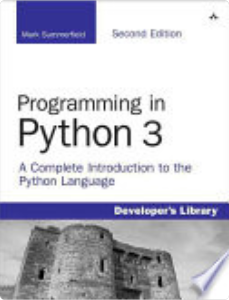

<h1>username: mor_2314 </h1>
<h1>password: 83r5^_</h1>

<br>
<br>
<br>


73-qatorga

```
<li class="nav-item flex items-center justify-between bg-[#F8FAFD] py-[15px] px-[10px] rounded-[4px] mb-[15px]">
         <span>
             <p class="rubik-font font-medium">Python</p>
             <p class="font-[Noto Sans, sans-serif] text-[#757881] text-[13px]">David M. Beazley</p>
         </span>
         <span class="flex gap-[6px]">
             <i class="bi bi-book text-[#75828A] text-xl"></i>
             <i class="bi bi-x-square text-[#FF6231] text-xl"></i>
         </span>
</li>

```

82-qatorga

```
<div class="bg-white py-[13px] px-[12px] rounded-[5px] shadow-md">
         <div class="py-[14px] bg-[#F8FAFD] rounded-[5px] px-[20px]">
             
         </div>
         <p class="font-medium text-[18px] pt-[13px] mb-1">Python</p>
         <p class="font-medium text-[13px] text-[#757881]">David M. Beazley</p>
         <p class="font-medium text-[13px] text-[#757881] mb-[10px]">2009</p>
         <div class="flex justify-between mb-[7px]">
             <button class="bg-[#FFD80D] py-[10px] px-[20px] font-medium rounded-[4px]">Bookmark</button>
             <button class="text-[#0D75FF] py-[10px] px-[20px] font-medium rounded-[4px] bg-[#0D75FF0D]">More Info</button>
         </div>
         <button class="bg-[#75828A] font-medium text-white py-[10px] w-full rounded-[4px]">Read</button>
     </div>
     <div class="bg-white py-[13px] px-[12px] rounded-[5px] shadow-md">
         <div class="py-[14px] bg-[#F8FAFD] rounded-[5px] px-[20px]">
             
         </div>
         <p class="font-medium text-[18px] pt-[13px] mb-1">Python</p>
         <p class="font-medium text-[13px] text-[#757881]">David M. Beazley</p>
         <p class="font-medium text-[13px] text-[#757881] mb-[10px]">2009</p>
         <div class="flex justify-between mb-[7px]">
             <button class="bg-[#FFD80D] py-[10px] px-[20px] font-medium rounded-[4px]">Bookmark</button>
             <button class="text-[#0D75FF] py-[10px] px-[20px] font-medium rounded-[4px] bg-[#0D75FF0D]">More Info</button>
         </div>
         <button class="bg-[#75828A] font-medium text-white py-[10px] w-full rounded-[4px]">Read</button>
     </div>
     <div class="bg-white py-[13px] px-[12px] rounded-[5px] shadow-md">
         <div class="py-[14px] bg-[#F8FAFD] rounded-[5px] px-[20px]">
             
         </div>
         <p class="font-medium text-[18px] pt-[13px] mb-1">Python</p>
         <p class="font-medium text-[13px] text-[#757881]">David M. Beazley</p>
         <p class="font-medium text-[13px] text-[#757881] mb-[10px]">2009</p>
         <div class="flex justify-between mb-[7px]">
             <button class="bg-[#FFD80D] py-[10px] px-[20px] font-medium rounded-[4px]">Bookmark</button>
             <button class="text-[#0D75FF] py-[10px] px-[20px] font-medium rounded-[4px] bg-[#0D75FF0D]">More Info</button>
         </div>
         <button class="bg-[#75828A] font-medium text-white py-[10px] w-full rounded-[4px]">Read</button>
     </div>
     <div class="bg-white py-[13px] px-[12px] rounded-[5px] shadow-md">
         <div class="py-[14px] bg-[#F8FAFD] rounded-[5px] px-[20px]">
             
         </div>
         <p class="font-medium text-[18px] pt-[13px] mb-1">Python</p>
         <p class="font-medium text-[13px] text-[#757881]">David M. Beazley</p>
         <p class="font-medium text-[13px] text-[#757881] mb-[10px]">2009</p>
         <div class="flex justify-between mb-[7px]">
             <button class="bg-[#FFD80D] py-[10px] px-[20px] font-medium rounded-[4px]">Bookmark</button>
             <button class="text-[#0D75FF] py-[10px] px-[20px] font-medium rounded-[4px] bg-[#0D75FF0D]">More Info</button>
         </div>
         <button class="bg-[#75828A] font-medium text-white py-[10px] w-full rounded-[4px]">Read</button>
     </div>
     <div class="bg-white py-[13px] px-[12px] rounded-[5px] shadow-md">
         <div class="py-[14px] bg-[#F8FAFD] rounded-[5px] px-[20px]">
             
         </div>
         <p class="font-medium text-[18px] pt-[13px] mb-1">Python</p>
         <p class="font-medium text-[13px] text-[#757881]">David M. Beazley</p>
         <p class="font-medium text-[13px] text-[#757881] mb-[10px]">2009</p>
         <div class="flex justify-between mb-[7px]">
             <button class="bg-[#FFD80D] py-[10px] px-[20px] font-medium rounded-[4px]">Bookmark</button>
             <button class="text-[#0D75FF] py-[10px] px-[20px] font-medium rounded-[4px] bg-[#0D75FF0D]">More Info</button>
         </div>
         <button class="bg-[#75828A] font-medium text-white py-[10px] w-full rounded-[4px]">Read</button>
     </div>
     <div class="bg-white py-[13px] px-[12px] rounded-[5px] shadow-md">
         <div class="py-[14px] bg-[#F8FAFD] rounded-[5px] px-[20px]">
             
         </div>
         <p class="font-medium text-[18px] pt-[13px] mb-1">Python</p>
         <p class="font-medium text-[13px] text-[#757881]">David M. Beazley</p>
         <p class="font-medium text-[13px] text-[#757881] mb-[10px]">2009</p>
         <div class="flex justify-between mb-[7px]">
             <button class="bg-[#FFD80D] py-[10px] px-[20px] font-medium rounded-[4px]">Bookmark</button>
             <button class="text-[#0D75FF] py-[10px] px-[20px] font-medium rounded-[4px] bg-[#0D75FF0D]">More Info</button>
         </div>
         <button class="bg-[#75828A] font-medium text-white py-[10px] w-full rounded-[4px]">Read</button>
     </div>
     <div class="bg-white py-[13px] px-[12px] rounded-[5px] shadow-md">
         <div class="py-[14px] bg-[#F8FAFD] rounded-[5px] px-[20px]">
             
         </div>
         <p class="font-medium text-[18px] pt-[13px] mb-1">Python</p>
         <p class="font-medium text-[13px] text-[#757881]">David M. Beazley</p>
         <p class="font-medium text-[13px] text-[#757881] mb-[10px]">2009</p>
         <div class="flex justify-between mb-[7px]">
             <button class="bg-[#FFD80D] py-[10px] px-[20px] font-medium rounded-[4px]">Bookmark</button>
             <button class="text-[#0D75FF] py-[10px] px-[20px] font-medium rounded-[4px] bg-[#0D75FF0D]">More Info</button>
         </div>
         <button class="bg-[#75828A] font-medium text-white py-[10px] w-full rounded-[4px]">Read</button>
     </div>
     <div class="bg-white py-[13px] px-[12px] rounded-[5px] shadow-md">
         <div class="py-[14px] bg-[#F8FAFD] rounded-[5px] px-[20px]">
             
         </div>
         <p class="font-medium text-[18px] pt-[13px] mb-1">Python</p>
         <p class="font-medium text-[13px] text-[#757881]">David M. Beazley</p>
         <p class="font-medium text-[13px] text-[#757881] mb-[10px]">2009</p>
         <div class="flex justify-between mb-[7px]">
             <button class="bg-[#FFD80D] py-[10px] px-[20px] font-medium rounded-[4px]">Bookmark</button>
             <button class="text-[#0D75FF] py-[10px] px-[20px] font-medium rounded-[4px] bg-[#0D75FF0D]">More Info</button>
         </div>
         <button class="bg-[#75828A] font-medium text-white py-[10px] w-full rounded-[4px]">Read</button>
     </div>
```

98-qatorga
```

   <p class="text-gray-500 text-left px-[40px] mb-[40px]">Lorem ipsum dolor sit amet consectetur
      adipisicing elit. Aspernatur odio animi perferendis itaque
      sit, porro non. Omnis at, molestias quasi libero dolorum similique placeat obcaecati deserunt.
      Ducimus explicabo earum ullam quas consectetur, tempore maiores pariatur debitis laudantium totam,
      cumque, omnis neque vel libero cum quia eveniet quaerat..</p>
   <div class="px-[40px]">
       <div class="flex gap-[10px] items-center mb-[14px]">
          <p class="text-[#222531] font-medium">Authors: </p>
          <div class="flex gap-[6px]">
              <p class="text-[#0D75FF] bg-[#0D75FF17] py-[5px] px-[18px] rounded-[30px] cursor-pointer">
                  Jamal Kasper</p>
              <p class="text-[#0D75FF] bg-[#0D75FF17] py-[5px] px-[18px] rounded-[30px] cursor-pointer">
                  Author 2</p>
          </div>
      </div>
       <div class="flex gap-[10px] items-center mb-[14px]">
          <p class="text-[#222531] font-medium">Published: </p>
          <p class="text-[#0D75FF] bg-[#0D75FF17] py-[5px] px-[18px] rounded-[30px] cursor-pointer">2019</p>
      </div>
       <div class="flex gap-[10px] items-center mb-[14px]">
          <p class="text-[#222531] font-medium">Publisher: </p>
          <p class="text-[#0D75FF] bg-[#0D75FF17] py-[5px] px-[18px] rounded-[30px] cursor-pointer">Hollman</p>
      </div>
       <div class="flex gap-[10px] items-center mb-[14px]">
          <p class="text-[#222531] font-medium">Categories: </p>
          <p class="text-[#0D75FF] bg-[#0D75FF17] py-[5px] px-[18px] rounded-[30px] cursor-pointer">Computers</p>
      </div>
       <div class="flex gap-[10px] items-center mb-[14px]">
          <p class="text-[#222531] font-medium">Pages Count: </p>
          <p class="text-[#0D75FF] bg-[#0D75FF17] py-[5px] px-[18px] rounded-[30px] cursor-pointer">346</p>
      </div>
   </div>
   <div class="p-[22px] bg-[#F8FAFD] flex justify-end">
      <a href="#" id="close-menu"
          class="px-[39px] py-[9px] cursor-pointer hover:bg-gray-500 bg-[#75828A] rounded-[4px] font-medium text-white">
          Read
      </a>
  </div>
```